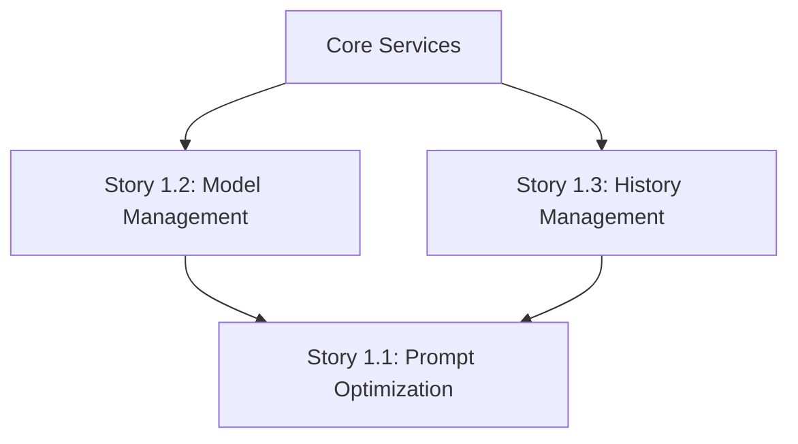

# Story Index - Epic 1: Core Features

This index tracks all user stories for Epic 1 (Core Features) of the prompt-optimizer project.

## Epic Overview

**Epic Name**: Core Features  
**Epic Goal**: Implement essential prompt optimization functionality including input handling, model management, and history tracking  
**Priority**: P0 (Critical - blocks release)  
**Estimated Completion**: 2-3 weeks

## Story List

| Story ID | Title                                  | Status | Priority | Est. Points | Assigned | Last Updated |
| -------- | -------------------------------------- | ------ | -------- | ----------- | -------- | ------------ |
| 1.1      | Prompt Optimization Core Functionality | Draft  | P0       | 8           | -        | 2026-02-19   |
| 1.2      | Model Management Configuration         | Draft  | P0       | 5           | -        | 2026-02-19   |
| 1.3      | History Record Management              | Draft  | P1       | 8           | -        | 2026-02-20   |

## Story Details

### Story 1.1: Prompt Optimization Core Functionality

**Status**: Draft  
**Priority**: P0 (Critical)  
**Est. Points**: 8

**Summary**: Implement the core prompt optimization feature with input handling, model selection, optimization flow, and result display.

**Acceptance Criteria**: 7 criteria covering input, model selection, optimization flow, actions, and error handling

**Dependencies**:

- Requires model service (from Story 1.2)
- Requires UI components from @prompt-optimizer/ui

**Risk Assessment**:

- Medium complexity due to streaming responses
- Integration with multiple LLM providers
- Real-time character counting performance

**Link**: [1.1.prompt-optimization-core.md](./1.1.prompt-optimization-core.md)

---

### Story 1.2: Model Management Configuration

**Status**: Draft  
**Priority**: P0 (Critical)  
**Est. Points**: 5

**Summary**: Enable users to configure, manage, and test multiple LLM models with secure API key storage.

**Acceptance Criteria**: 7 criteria covering CRUD operations, security, validation, and testing

**Dependencies**:

- Requires encryption service
- Requires secure storage implementation

**Risk Assessment**:

- Security is critical (API key encryption)
- Data validation complexity
- Connection testing reliability

**Link**: [1.2.model-management-configuration.md](./1.2.model-management-configuration.md)

---

### Story 1.3: History Record Management

**Status**: Draft  
**Priority**: P1 (High)  
**Est. Points**: 8

**Summary**: Implement comprehensive history tracking with search, filter, reuse, import, and export capabilities.

**Acceptance Criteria**: 8 criteria covering storage, display, search, actions, import, and export

**Dependencies**:

- Requires storage service
- Requires history service from core package

**Risk Assessment**:

- Performance with large datasets
- Storage quota management
- Export functionality edge cases

**Link**: [1.3.history-record-management.md](./1.3.history-record-management.md)

## Progress Tracking

### Velocity Tracking

| Sprint | Committed | Completed | Velocity |
| ------ | --------- | --------- | -------- |
| -      | -         | -         | -        |

> **Note**: Velocity tracking begins after the first sprint. Use story points from completed stories to calculate velocity.

### Completion Metrics

- **Total Stories**: 3
- **Total Points**: 21
- **Completed**: 0
- **In Progress**: 0
- **Remaining**: 21 points

### Status Distribution

- **Draft**: 3 stories
- **Approved**: 0 stories
- **InProgress**: 0 stories
- **Review**: 0 stories
- **Done**: 0 stories

## Dependencies

## Risks and Mitigation

| Risk                          | Probability | Impact   | Mitigation                                  |
| ----------------------------- | ----------- | -------- | ------------------------------------------- |
| Streaming response complexity | Medium      | High     | Implement incrementally, test thoroughly    |
| API key security              | Low         | Critical | Use encryption, code review, security audit |
| Storage performance           | Low         | Medium   | Implement pagination, virtual scrolling     |
| Multi-model compatibility     | Medium      | Medium   | Comprehensive integration tests             |

## Definition of Done

Each story is considered "Done" when:

- [ ] All acceptance criteria met
- [ ] Code reviewed and approved
- [ ] Unit tests written (>80% coverage)
- [ ] Integration tests passing
- [ ] Documentation updated
- [ ] No regressions in existing functionality
- [ ] Performance benchmarks met
- [ ] Accessibility standards met (WCAG 2.1 AA)

## Notes

- Stories should be implemented in order: 1.2 → 1.1 → 1.3
- Story 1.2 (Model Management) is a prerequisite for Story 1.1
- Consider creating Story 1.4 for UI/UX enhancements after core features are complete
- Monitor velocity to adjust estimates if needed

## Story Quality Indicators

| Story ID | AC Count | Task Count | Has Source Refs | Has Test Plan | Quality Score |
| -------- | -------- | ---------- | --------------- | ------------- | ------------- |
| 1.1      | 7        | 6          | Yes             | Yes           | 100/100       |
| 1.2      | 7        | 6          | Yes             | Yes           | 100/100       |
| 1.3      | 8        | 7          | Yes             | Yes           | 100/100       |

**Average Quality Score**: 100/100 (Excellent)

---

**Last Updated**: 2026-02-22
